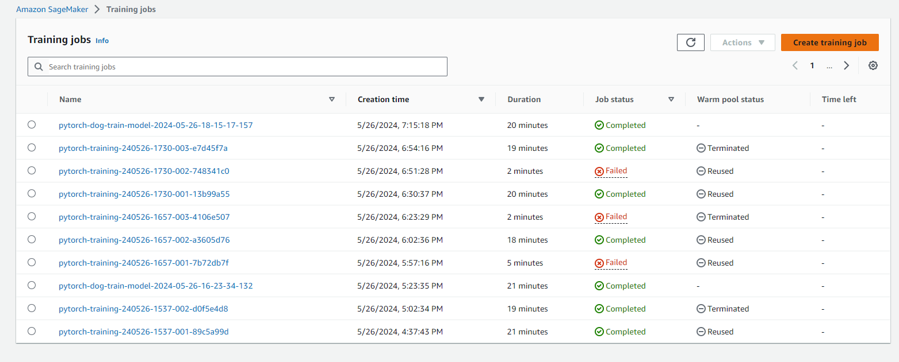

# Image Classification using AWS SageMaker

Use AWS Sagemaker to train a pretrained model that can perform image classification by using the Sagemaker profiling, debugger, hyperparameter tuning and other good ML engineering practices. This can be done on the provided dog breed classication data set.

## Project Set Up and Installation
Enter AWS and open SageMaker Studio. 

## Dataset
The provided dataset is the [dogbreed classification dataset](https://s3-us-west-1.amazonaws.com/udacity-aind/dog-project/dogImages.zip).

### Access
Upload the data to an S3 bucket so that SageMaker has access to the data. 

## Hyperparameter Tuning
For the pretrained model, I chose the ResNet-50 architecture. I also added two fully-connected layers (with ReLU in between) so that the pretrained model can be trained further and well adapted to my classification task, i.e., the output must have a dimension of 133.

I tuned two hyperparameters. One is the batch size at the train, validation and test stages. In the hyperparameter tuning, its range is a set of five number: {32, 64, 128, 256, 512}. The best hyperprameter found is 32. The second hyperparameter is the learning rate. In the hyperparameter tuning, its range is an interval: (0.001, 0.1). The best hyperprameter found is 0.0010770764232585321.

Below is a screenshot showing the training job (the first one in the list) was done.



## Debugging and Profiling
To perform model debugging and profiling in Sagemaker, below are some important steps 

1. Set the debugging and profiling rules that I care about and against which I want to check to make sure the model is fine
2. Set configurations for the debugging and profiling (using the DebuggerHookConfig() and ProfilerConfig() functions from the sagemaker.debugger module respectively)
3. Retrive the best set of hyperparameters from the hyperparameter tuning
4. Modify the code (hpo.py) used in the hyperparameter tuning so that the new code (train_model.py) is able to track the important variables that I want the debugging and profiling to track
5. Create a new estimator and fit it using all above
6. I can load the saved data in a SageMaker Debugger trial and do an analysis on the data such as ploting a debugging output
7. The profiler report is auto-generated in S3 which I can retrieve and display

### Results
The debugging output looks fine. The train loss declines steadily while the test loss keeps steady. Looking at the profiler report, no rule is checked, so it is good news. The training job took about 20 minutes. The report does provide recommendations to prevent each rule from being checked, which I can follow further to improve the code.

## Model Deployment
The model was deployed with an instance count of 1 and an instance type of ml.m5.large. It is simply the model with the best set of hyperparameters from the hyperparameter tuning. The deployment was done with the help of an auxiliary script (inference.py) provided by Udaicty. It receives the deployed model and the user-provided input to return a prediction of the dog breed.

To query the endpoint with a sample input, I need to convert the image to the bytes type and run the code below, where img_bytes is the bytes format image. The "predictor" can be recreated as long as I know the endpoint name. The code will return the index of the breed the dog belongs to.

```
response = predictor.predict(img_bytes, initial_args = {"ContentType": "image/jpeg"})
import numpy as np
np.argmax(response, 1)
```

Below is a screenshot showing the deployed active endpoint in Sagemaker.


